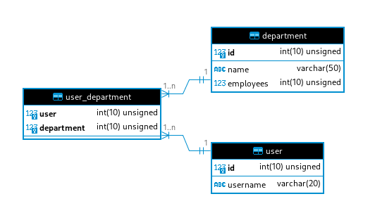

# Avaliação ZPT Digital

Obrigado por dedicar seu tempo à avaliação da ZPT Digital!

O intuito deste teste é termos uma amostra do seu trabalho nos mais diferentes níveis. Faça-o como se você já tivesse sido contratado pela ZPT Digital e estas fossem suas primeiras tarefas nos nossos repositórios. Use esta avaliação para mostrar o melhor de si!

## Questões
Faça as questões em ordem.

Algumas questões podem parecer enigmáticas e pouco detalhadas. Isso é intencional.

Crie uma branch para cada questão e mescle para a `master`.

Ao concluir o teste, compacte e devolva o repositório com suas alterações.

---------------------
**DDL (MySQL)**
```sql
CREATE TABLE `user` (
  `id` int unsigned NOT NULL AUTO_INCREMENT,
  `username` varchar(20) NOT NULL,
  PRIMARY KEY (`id`)
) ENGINE=InnoDB;

CREATE TABLE `department` (
  `id` int unsigned NOT NULL AUTO_INCREMENT,
  `name` varchar(50) NOT NULL,
  `employees` int unsigned NOT NULL,
  PRIMARY KEY (`id`)
) ENGINE=InnoDB;

CREATE TABLE `user_department` (
  `user` int unsigned NOT NULL,
  `department` int unsigned NOT NULL,
  PRIMARY KEY (`user`,`department`),
  CONSTRAINT `FK_department` FOREIGN KEY (`department`) REFERENCES `department` (`id`) ON DELETE RESTRICT ON UPDATE RESTRICT,
  CONSTRAINT `FK_user` FOREIGN KEY (`user`) REFERENCES `user` (`id`) ON DELETE RESTRICT ON UPDATE RESTRICT
) ENGINE=InnoDB;
```
---------------------

1) Desenhe o MER.

1. Levantei um container de mariadb 
    $docker-compose up$
2. Separei a estrutura em um arquivo sql dentro de bin
3. Criei a estrutura com o comando do executavel [create_database](./bin/create_database)
4. Extrai com DBeaver o modelo lógico



2) O método em [/src/User.php#L7-L15](./src/User.php#L4-L11) está muito lento. Deixe-o mais rápido. Esse método é em pseudocódigo PHP, isto é, não é possível executá-lo de fato. Sua solução pode ser em pseudocódigo também.

1. Ao ver o código um problema obvio é estar fazendo a query dentro de um looping, fazendo ir e voltar do banco de dados varias vezes
2. Removi o loop e adicionei para a query ser feita com o where usando "id IN (id, id...)"

3) Ainda referente ao método da questão anterior, melhore o nome dele.

* normalmente quando usamos um framework, o metodo find do orm leva um unico id para retornar um registro
* utilizar find_many com um array de ids me parece ser a alternativa mais legivel

4) Tomando por base o pseudocódigo que já existe, implemente um método que retorne o maior departamento (o que tiver mais `employees`) de cada usuário, isto é, de todos os usuários de uma vez, sem qualquer filtro.

* optei por implementar um metodo estatico na classe Departamento que realiza essa query em especifico retornando o departamento
    * porem nessa questão me vêm a duvida, há um contador de employees em cada registro de departamento. Meu primeiro pensamento era de fazer um agrupamento na tabela user_department
    * o termo user pode ser uma entidade diferente de employee, os users do departamento de marketing poderiam muito be ser clientes que o marketing atende, nessa questão seria necessario exclarecer essa duvida para prosseguir com segurança
    * o prazo é amanhã e a questão pede especificamente para utilizar a coluna employees, mas no dia dia de trabalho eu com certeza tentaria entender melhor essa diferença de terminologia
    * `Department::largest()` supostamente retornaria o maior


5) O que pode ser feito para deixar a query abaixo mais rápida?

```sql
SELECT dept.id FROM user
INNER JOIN user_department u_d ON u_d.user = user.id
INNER JOIN department dept ON u_d.department = dept.id
WHERE user.username = 'zpt'
```

* nessa query acredito que estavamos fazendo varios joins e depois filtrando
* mas a filtragem não depende do resultado desses joins, somente da tabela user
    * considerar no join todos os usuarios da tabela pode ser desnecessario já que literalmente só queremos o zpt
* a minha solução seria filtrar primeiro a tabela user e utilizar esse resultado para fazer o join

```sql
SELECT dept.id FROM (SELECT id FROM `user` WHERE username = 'joao') as user_q
INNER JOIN user_department u_d ON u_d.user = user_q.id
INNER JOIN department dept ON u_d.department = dept.id
```

6) A classe `User` tem o método `setDb()` que recebe uma conexão com o banco de dados. As classes `Company` e `Department` precisam ter esse mesmo método, idêntico. Implemente.

* criado a classe abstrata BaseClass que serve para possibilitar que outras classes acessem o bando de dados e metodos em comun
* o attributo db foi de private para protected para poder ser usado na herança

7) [Esta função](./src/Utils.php#L4) permite atribuir uma conexão em estilo procedural. Faça a função aceitar instâncias de `Company` e `Department` também.

* Na questão anterior foi adicionado a classe abstrata BaseClass
* trocando \User\User por \BaseClass podemos fazer com que a função aceite agora também Company e Department

8) Utilize a API https://ipinfo.io/json via JavaScript para consultar o IP do usuário e exibir na lacuna designada em [./src/index.html](./src/index.html).

* simples fetch e append no elemento de ID 'ip'
* adblocks como ublock origin bloqueiam a requisição e fazem o navegador retornar erro de cors.
    * caso o ip não apareça verifique as extensões

9) Crie a classe `CompanyClient`, que é uma `Company` que, além do `id`, tem um número chamado `registration`. A saudação deve exibir o `id` e o `registration`.

* foi criado a classe CompanyClient que é uma company
    * passa pela função quando  `function requiresCompany(Company $company){}`
* modificado id para ser protected e acessivel para a classes que herdam Company
* adicionado registration e novo metodo com mesma assinatura de greetings

10) Qual commit introduziu [este erro](./src/Department.php#L10)? Explique e corrija o erro.
